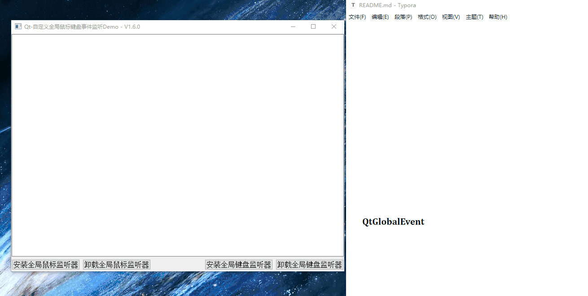

[](https://blog.csdn.net/qq_43627907?type=blog)[](https://gitee.com/mahuifa/QMDemo)[](https://github.com/mahuifa/QMDemo)

# 这是一个使用Qt封装的全局鼠标、键盘事件监听器的库

| 功能  | 系统 | 是否实现 | 实现方式 |
| ---- | ---- | ---- | ---- |
|              |        |          |                |
| 全局鼠标事件监听器  | Windows   |  已实现    | user32鼠标钩子 |
| 全局鼠标事件监听器  | Linux     |  已实现    | x11 API |
| 全局键盘事件监听器  | Windows   |  已实现    | user32键盘钩子 |
| 全局键盘事件监听器  | Linux     |  暂未实现 | x11 xcb API |

* 备注：Linux下全局键盘事件监听器通过使用X11 API已经获取到了全局键盘事件，但是不知道怎么将X11键盘事件映射为QKeyEvent，通过阅读Qt源码，发现Qt使用的是xcb将xkb映射为QKeyEvent，后续有时间在继续研究<mark>（有懂的朋友欢迎补充，或者联系我：1603291350@qq.com）</mark>。
* Linux键盘事件映射QKeyEvent源码位置：`D:\Qt\Qt5.12.5\5.12.5\Src\qtbase\src\plugins\platforms\xcb\qxcbkeyboard.cpp`

## 实现效果




## 使用方式

* 可以看示例程序[Examples](./Examples)

- 新建一个工程，在pro文件中引入模块

  ```makefile
  include($$PWD/GlobalMouseKey/GlobalMouseKey.pri)
  INCLUDEPATH += $$PWD/GlobalMouseKey
  ```

- 在需要使用到全局鼠标、键盘事件的类中添加头文件

  ```cpp
  #include <globalmouseevent.h>
  #include "globalkeyevent.h"
  ```

- 绑定对应的信号

  ```cpp
  connect(GlobalMouseEvent::getInstance(), &GlobalMouseEvent::mouseEvent, this, &Widget::on_mouseEvent);
  connect(GlobalMouseEvent::getInstance(), &GlobalMouseEvent::wheelEvent, this, &Widget::on_wheelEvent);
  connect(GlobalKeyEvent::getInstance(), &GlobalKeyEvent::keyEvent, this, &Widget::on_keyEvent);
  ```

- 安装全局鼠标、键盘事件监听器后就可以使用了

  ```cpp
  /**
   * @brief 安装全局鼠标事件监听器
   */
  void Widget::on_but_mouseI_clicked()
  {
      bool ret = GlobalMouseEvent::installMouseEvent();
      ui->textEdit->append(QString("<<<<<<<<<< 全局鼠标事件监听器安装%1 >>>>>>>>>>").arg(ret ? "成功" : "失败"));
  }
  
  /**
   * @brief 卸载全局鼠标事件监听器
   */
  void Widget::on_but_mouser_clicked()
  {
      bool ret = GlobalMouseEvent::removeMouseEvent();
      ui->textEdit->append(QString("<<<<<<<<<< 全局鼠标事件监听器卸载%1 >>>>>>>>>>").arg(ret ? "成功" : "失败"));
  }
  
  /**
   * @brief 安装全局键盘事件监听器
   */
  void Widget::on_but_keyI_clicked()
  {
      bool ret = GlobalKeyEvent::installKeyEvent();
      ui->textEdit->append(QString("<<<<<<<<<< 全局键盘事件监听器安装%1 >>>>>>>>>>").arg(ret ? "成功" : "失败"));
  }
  
  /**
   * @brief 卸载全局键盘事件监听器
   */
  void Widget::on_but_KeyR_clicked()
  {
      bool ret = GlobalKeyEvent::removeKeyEvent();
      ui->textEdit->append(QString("<<<<<<<<<< 全局键盘事件监听器卸载%1 >>>>>>>>>>").arg(ret ? "成功" : "失败"));
  }
  
  ```

- 注意：每个信号建议只绑定一次，接收到信号后由于是指针，在使用完成后记得delete
